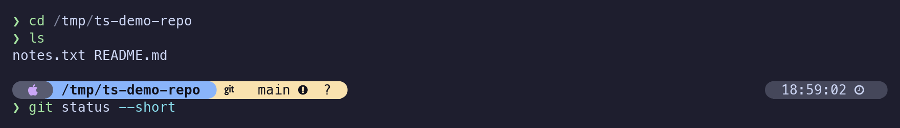
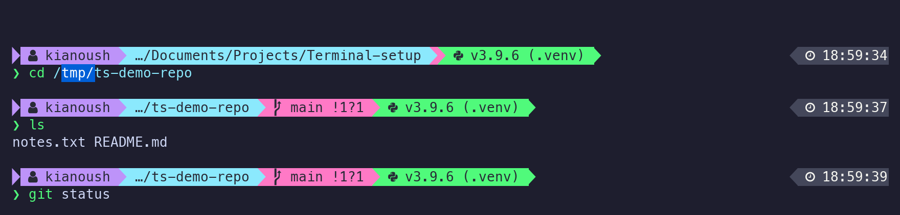
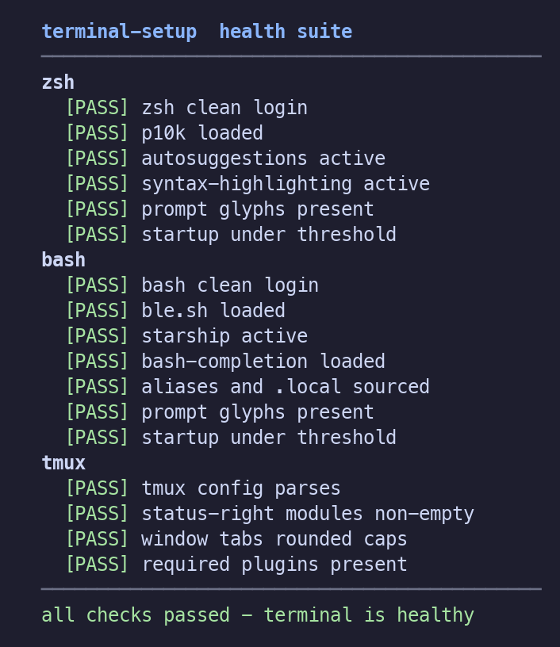

# Terminal Setup

A from-scratch, idempotent provisioner that turns a clean macOS or Linux machine
into a polished terminal: **zsh + Powerlevel10k**, **bash + starship**, and
**tmux with a Catppuccin status bar** - one command, fully backed up and
reversible, and verified healthy by a deep functional test suite.

Built with **Ansible + Python**: pure, unit-tested Python engines behind thin
Ansible modules, so failures come with precise, structured messages.

---

## 1. What you get

**zsh** - Powerlevel10k "pill" prompt (Catppuccin Mocha), git status, valid
commands green / unknown red, fish-like autosuggestions:



**bash** - a deliberately different look: Dracula sharp-triangle starship ribbon
with ble.sh syntax highlighting:



**tmux** - Catppuccin status bar: window tabs bottom-left (rounded pills),
battery / date-time / session bottom-right, transparent middle:


**Verified healthy** - every run ends with a deep functional health suite:



---

## 2. Features

- **zsh:** Powerlevel10k (Catppuccin Mocha pills), zsh-autosuggestions,
  zsh-syntax-highlighting (green commands, red unknowns, sky flags), fast cached
  `compinit`, instant prompt.
- **bash:** starship (Dracula triangles), ble.sh line editor with syntax
  highlighting + autosuggestions, bash-completion@2.
- **tmux:** tpm + catppuccin + tmux-battery (+ sensible, yank); window tabs,
  battery / date-time / session, transparent bar; on batteryless hosts (e.g.
  VMs) the battery item and plugin are omitted entirely. Mouse selection and
  copy-mode `y` land in the system clipboard (wl-clipboard / xsel are installed
  as prereqs on Linux; macOS uses pbcopy).
- **Fonts:** MesloLGS, JetBrainsMono and FiraCode Nerd Fonts.
- **Framework cleanup:** competing prompt frameworks (oh-my-zsh, oh-my-posh)
  are uninstalled so they never fight the rendered prompts - user content
  (oh-my-zsh `custom/`) is backed up first and every reference is scrubbed from
  the `.local` files. Opt out with `ts_uninstall_frameworks: false`.
- **iTerm2 (macOS):** profile font + window transparency.
- **Safe & reversible:** every replaced file is backed up; your custom content is
  preserved; a single `--restore` reverts everything.
- **Glyph-safe templating:** powerline/Nerd glyphs are injected by codepoint, so
  they never get stripped to empty.

---

## 3. Supported platforms

| Platform | Package source |
|----------|----------------|
| macOS (Apple Silicon & Intel) | Homebrew |
| Debian / Ubuntu | apt (prereqs) + Linuxbrew (stack) |
| Fedora / RHEL | dnf (prereqs) + Linuxbrew (stack) |
| Arch | pacman (prereqs) + Linuxbrew (stack) |

The native package manager installs only base prerequisites; the terminal stack
is installed uniformly via Homebrew / Linuxbrew.

---

## 4. Prerequisites

`bootstrap.sh` installs anything missing - **git, curl, python3, Ansible, and
Homebrew** - so a brand-new machine needs nothing but network access. On Linux,
`sudo` is required to install base prerequisites.

---

## 5. Quick start

```bash
git clone <this-repo> ~/.terminal-setup && cd ~/.terminal-setup
./bootstrap.sh
```

Preview everything first, changing nothing:

```bash
./bootstrap.sh --check     # Ansible --check --diff: shows the full config diffs
```

After it finishes, **open a new shell** (and restart iTerm2 on macOS to pick up
the font/transparency).

---

## 6. What it does, step by step

```
bootstrap.sh
  └─ installs prereqs (git/curl/python3/Ansible/Homebrew) if missing
  └─ runs ansible-playbook site.yml:
       1. preflight    validate OS, network, sudo, disk, writable targets
                       (reports ALL problems up front, then fail-fast)
       2. packages     install zsh/bash/tmux/starship/plugins per-OS
       3. frameworks   uninstall competing prompt frameworks (oh-my-zsh,
                       oh-my-posh) with backups; disable via
                       ts_uninstall_frameworks=false
       4. fonts        install MesloLGS + JetBrainsMono + FiraCode Nerd Fonts
       5. zsh          render ~/.zshrc + ~/.p10k.zsh, deep zsh health probe
       6. bash         render ~/.bashrc + ~/.bash_profile + starship.toml,
                       install ble.sh, deep bash health probe
       7. tmux         install tpm + plugins, render ~/.tmux.conf, deep tmux probe
       8. chsh         set zsh as the default login shell (skips if already zsh)
       9. iterm2       set font + transparency (macOS only)
      10. healthcheck  final health summary
```

Every config is rendered from a Jinja2 template and deployed through the merge
engine (see §9). Re-running is idempotent - unchanged tasks report `ok`, not
`changed`.

---

## 7. Flags

| Command | Effect |
|---------|--------|
| `./bootstrap.sh` | Full provisioning run |
| `./bootstrap.sh --check` | Preview every change with diffs; modifies nothing |
| `./bootstrap.sh --skip-iterm2` | Skip the macOS iTerm2 step |
| `./bootstrap.sh --restore [--list] [--snapshot STAMP]` | Revert managed files from a backup snapshot |
| `./bootstrap.sh --help` | Show usage |

---

## 8. Customizing

All theming and package choices live in **`group_vars/all.yml`** and the role
`defaults/` - no template edits needed:

- **Palettes:** `ts_zsh_palette` (Catppuccin Mocha), `ts_bash_palette` (Dracula),
  `ts_tmux_palette` + `ts_tmux_flavor`.
- **Fonts:** `ts_fonts` (defaults to all three).
- **Packages:** `ts_packages` + `ts_package_map` (logical → per-manager names).
- **iTerm2:** `ts_iterm2_font`, `ts_iterm2_transparency`.

Change a palette value and re-run - the prompts retheme without touching any
template.

---

## 9. Your existing config (backups & the `.local` merge)

Nothing is lost. For each managed file (`.zshrc`, `.bashrc`, `.bash_profile`,
`.tmux.conf`, `starship.toml`):

1. The original is **backed up** to
   `~/.terminal-setup/backups/<UTC-timestamp>/` (recorded in `manifest.jsonl`).
2. The tool owns only the content between markers:
   ```
   # >>> terminal-setup >>>
     ... rendered prompt / plugins / theme ...
   # <<< terminal-setup <<<
   ```
3. Your custom lines are moved into a sibling **`.local`** file
   (`~/.zshrc.local`, etc.) that the managed block sources at the end - so your
   aliases, exports and tweaks keep working. Tool-owned prompt/plugin lines are
   scrubbed so they are never duplicated.

Re-running rewrites only the managed block and leaves your `.local` untouched.

---

## 10. Health checks & troubleshooting

The run ends with a **deep functional suite** (shown above). Each shell is
launched for real under a PTY and checked:

- **zsh:** clean login, p10k + both plugins loaded, prompt glyphs present,
  startup under threshold.
- **bash:** clean login, ble.sh + starship + bash-completion loaded, aliases /
  `.local` sourced, glyphs present, fast startup.
- **tmux:** config parses, status-right modules non-empty, window tabs have
  rounded caps, plugins present.

If a probe fails, the run stops with a specific reason (e.g. which probe and
why). Backups are always left intact, so you are never left with a half-broken
shell. Re-run with `--check` to preview, or `--restore` to revert.

---

## 11. Uninstall / restore

Revert the managed files to their pre-run state from a backup snapshot:

```bash
./bootstrap.sh --restore --list          # show available snapshots
./bootstrap.sh --restore                 # revert the latest snapshot
./bootstrap.sh --restore --snapshot 20260628T174929Z
```

Restore is idempotent and reports exactly which files it reverted; it fails fast
with a clear message if the snapshot or manifest is missing.

---

## Development

```bash
python3 -m venv .venv && . .venv/bin/activate
pip install -r requirements-dev.txt
pytest
```

The provisioning logic lives in pure, unit-tested Python (`module_utils/`,
`tooling/`) behind thin Ansible modules (`library/`) and roles (`roles/`). Design
docs and the issue breakdown are under `docs/`.
